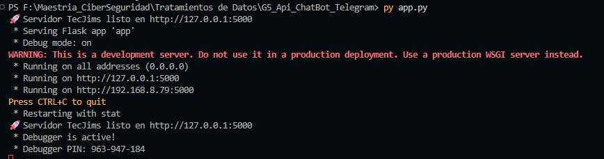
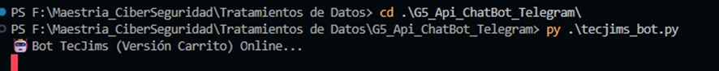
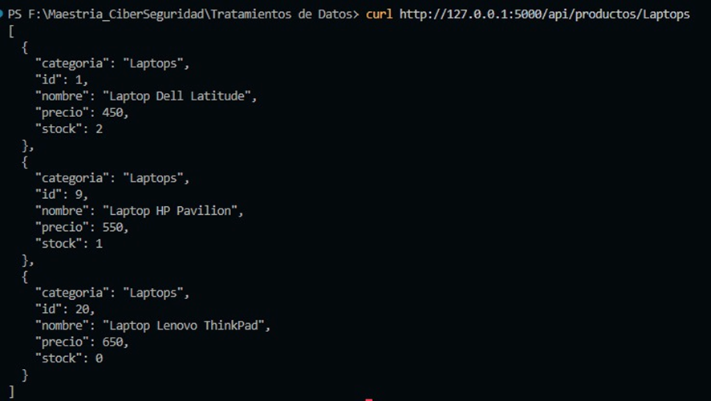
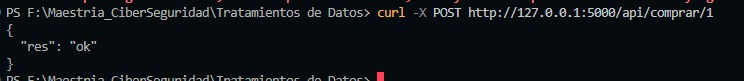
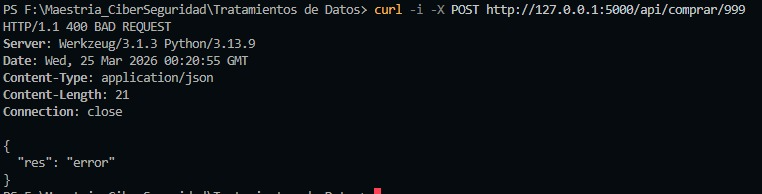
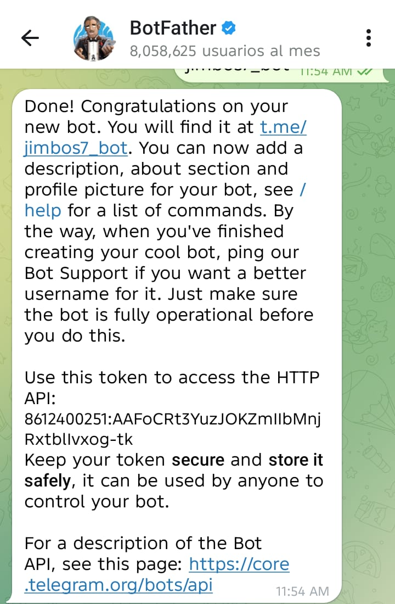
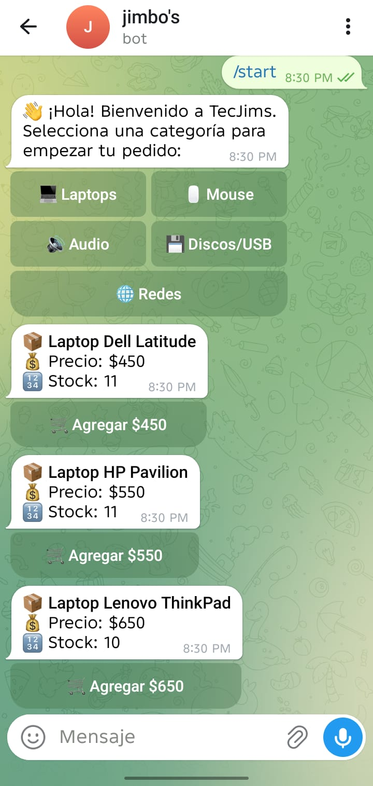
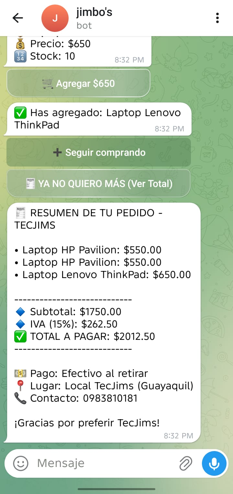
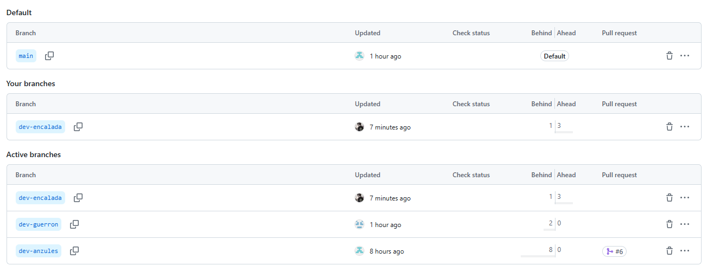

# G5_Api_ChatBot_Telegram
Practica 1 Tratamiento de Datos

Parte 1 – Construcción del API (app.py) mediante Flask y Boot de Telegram
El núcleo del sistema es una API desarrollada en Python 3.10 con el framework Flask.
Funcionalidades y Endpoints:
Persistencia: Manejo de base de datos local en formato datos.json.
GET /api/productos/<cat>: Recupera productos filtrados por categoría (Laptops, Mouse, Audio, etc.).
POST /api/comprar/<int:id_p>: Procesa la compra disminuyendo el stock en tiempo real. Incluye validación de existencia de ID y disponibilidad de inventario.
Creatividad (Extra): Integración de un Bot de Telegram (tecjims_bot.py) que consume estos endpoints para ofrecer una interfaz de compra interactiva.
Se ejecuta localmente archivos app.py y tecjims_bot.py 

    

Pruebas exitosas de curl, validación de EndPoints
METODO GET
 

METODO POST
 

VALIDACIÓN DE ERROR 400

Se crea el Boot y genera un Token para ser utilizado en el proyecto.

El API se lo integra con un chatBoot de Telegram

 

Parte 2 – Uso de Branches (GitHub)
Se implementó una estrategia de ramificación para permitir el trabajo en paralelo y asegurar la integridad del código en main:
main: Rama estable de producción.
dev-anzules: Desarrollo de la parte lógica del bot de telegram, juntos con los archivos para ejecutar en Docker
dev-encalada: Desarrollo de app.py donde se encuentran los métodos GET y POST
dev-guerron: Desarrollo del archivo datos.json donde se encuentra los productos según su categoria

