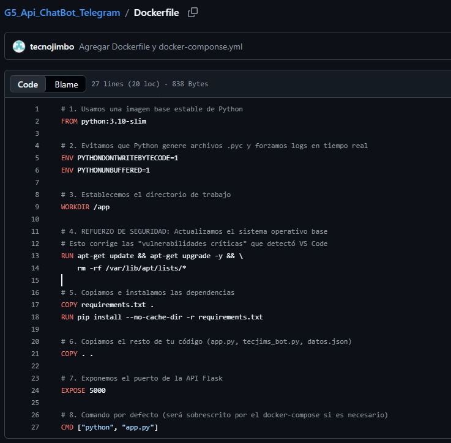
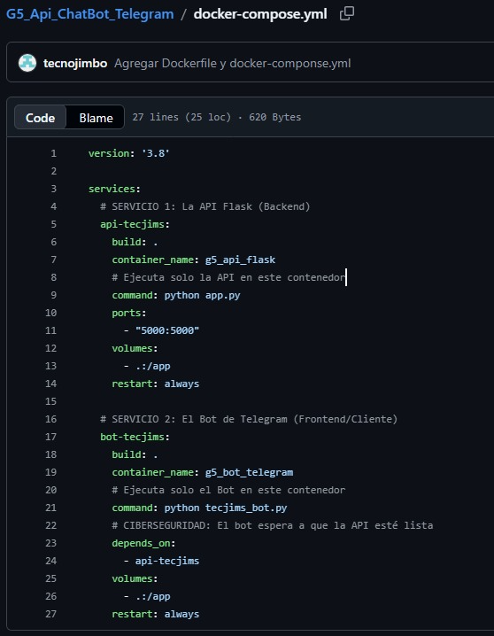
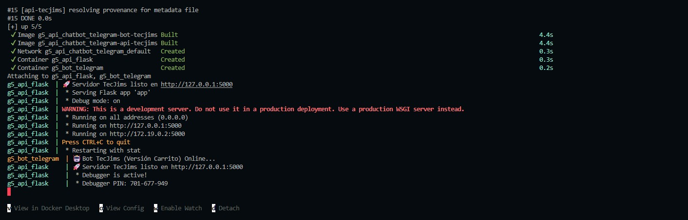
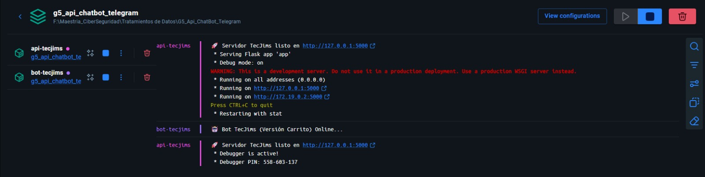

# G5_Api_ChatBot_Telegram
Practica 1 Tratamiento de Datos

Parte 1 – Construcción del API (app.py) mediante Flask y Boot de Telegram
El núcleo del sistema es una API desarrollada en Python 3.10 con el framework Flask.
Funcionalidades y Endpoints:
Persistencia: Manejo de base de datos local en formato datos.json.
GET /api/productos/<cat>: Recupera productos filtrados por categoría (Laptops, Mouse, Audio, etc.).
POST /api/comprar/<int:id_p>: Procesa la compra disminuyendo el stock en tiempo real. Incluye validación de existencia de ID y disponibilidad de inventario.
Creatividad (Extra): Integración de un Bot de Telegram (tecjims_bot.py) que consume estos endpoints para ofrecer una interfaz de compra interactiva.
Se ejecuta localmente archivos app.py y tecjims_bot.py 

   

Pruebas exitosas de curl, validación de EndPoints
METODO GET

 

METODO POST

 

VALIDACIÓN DE ERROR 400

Se crea el Boot y genera un Token para ser utilizado en el proyecto.

El API se lo integra con un chatBoot de Telegram

 

Parte 2 – Uso de Branches (GitHub)
Se implementó una estrategia de ramificación para permitir el trabajo en paralelo y asegurar la integridad del código en main:
main: Rama estable de producción.
dev-anzules: Desarrollo de la parte lógica del bot de telegram, juntos con los archivos para ejecutar en Docker
dev-encalada: Desarrollo de app.py donde se encuentran los métodos GET y POST
dev-guerron: Desarrollo del archivo datos.json donde se encuentra los productos según su categoria

Parte 3 Contenerización.

Para proceder a ejecutar los comandos de docker se crearon dos archivos 
Dockerfile

docker-compose.yml

Ejecucion de Docker con comando docker-compose up --build

Ejecución de Docker en aplicación

Parte 4 Curl

 

 

Conclusión
Este proyecto fue un gran reto para el Grupo 5, donde logramos unir nuestras habilidades para crear una solución tecnológica real. Más allá de las herramientas como Docker o Flask, aprendimos el valor de trabajar en equipo de forma organizada a través de GitHub. Lograr que un bot de Telegram hable con nuestra propia API y que todo funcione de forma segura en la nube nos da la confianza de que estamos listos para enfrentar desafíos técnicos modernos, siempre enfocados en la seguridad y la eficiencia para el usuario final.

# Preguntas de Retroalimentación - G5

# 1. Si este sistema creciera a un entorno real de e-commerce, ¿qué cambios estructurales considerarían necesarios?

El sistema actual es funcional, pero al escalar a un entorno real con miles de usuarios presentaría fallas debido a su diseño monolítico y procesamiento síncrono.
Es necesario reemplazar el uso de archivos JSON por una base de datos como MySQL o PostgreSQL para garantizar integridad de datos y manejo de múltiples solicitudes concurrentes.
Se deben implementar mecanismos de seguridad, como autenticación, control de accesos y validación de datos en el backend, evitando confiar en la información proveniente del cliente.
La arquitectura puede evolucionar hacia microservicios, separando componentes como inventario, pagos, usuarios y comunicación con el bot, lo que permite escalar cada parte de forma independiente.
Es recomendable incorporar procesamiento asíncrono mediante colas de mensajería como RabbitMQ o Redis, para evitar bloqueos y mejorar el rendimiento del sistema.
El uso de contenedores Docker junto con herramientas de orquestación permitirá escalar automáticamente el sistema según la demanda.
La implementación de una capa de caché, por ejemplo Redis, optimiza el acceso a datos frecuentes y reduce la carga sobre la base de datos.
En conjunto, estos cambios permiten que el sistema evolucione hacia una solución más escalable, segura y eficiente para un entorno real de e-commerce.

# 2. ¿Cómo garantizarían consistencia en el inventario ante múltiples solicitudes simultáneas de compra?

Uno de los principales problemas en sistemas de e-commerce es la concurrencia, especialmente cuando varios usuarios intentan comprar el mismo producto al mismo tiempo, lo que puede generar condiciones de carrera (race conditions).
Para evitar inconsistencias en el inventario, es necesario implementar mecanismos que garanticen que las operaciones sobre el stock sean seguras y controladas.
Las operaciones de actualización del stock deben ejecutarse como una sola unidad indivisible. Por ejemplo, una consulta como:
UPDATE productos SET stock = stock - 1 WHERE id = ? AND stock > 0; asegura que solo se descuente el stock si hay disponibilidad, evitando valores negativos.
Mediante el uso de consultas como SELECT ... FOR UPDATE, se bloquea temporalmente el registro del producto mientras se procesa la compra, impidiendo que otros procesos lo modifiquen simultáneamente.
Consiste en agregar un campo de versión al registro. Si al momento de actualizar el stock la versión ha cambiado, se detecta que otro proceso ya modificó el dato y se rechaza la operación para evitar inconsistencias.
Cuando un usuario inicia el proceso de compra, el producto puede reservarse por un tiempo determinado. Si la compra no se completa, el stock se libera automáticamente.

Adicionalmente, es importante destacar que en el sistema actual basado en archivos JSON no es posible garantizar este nivel de control, por lo que es necesario el uso de una base de datos que permita manejar transacciones y concurrencia.
En resumen, la consistencia del inventario se logra mediante el uso de transacciones, control de concurrencia y mecanismos de validación que aseguren que el stock sea una única fuente de verdad confiable.

